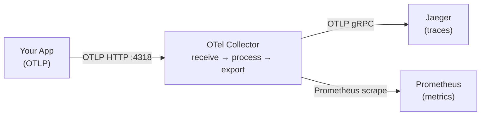
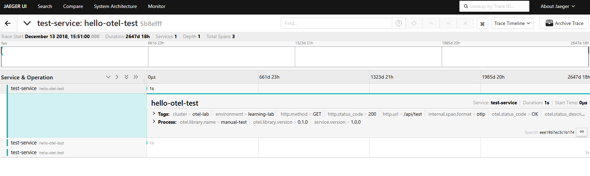

# 01 — Quick Start: OTel Collector on Kubernetes

> Verify the OpenTelemetry Collector is running and send your first trace.

## ⚠️ Prerequisites

Before exploring this module, make sure you have completed the installation steps from the [main README](../README.md).

---

## 🎯 Learning Objectives

- Understand what the OTel Collector does (receive → process → export)
- Verify the Collector and Jaeger are running
- Send a manual test trace via OTLP HTTP
- See the trace appear in Jaeger

## 🧠 Key Concept: The Collector Role



---

## 🔭 Explore

### Step 1: Verify the deployment

```bash
# Check all pods are running
kubectl get pods -n observability
```

Expected output:
```
NAME                                              READY   STATUS
jaeger-xxxxxxxxx-xxxxx                            1/1     Running
otel-collector-opentelemetry-collector-xxxxx      1/1     Running
kube-prometheus-stack-grafana-xxxxx               1/1     Running
kube-prometheus-stack-prometheus-xxxxx            1/1     Running
opentelemetry-operator-xxxxx                      1/1     Running
```

```bash
# Check Collector logs
kubectl logs -l app.kubernetes.io/name=opentelemetry-collector -n observability --tail=20
```

### Step 2: Send a manual test trace

Open port-forwards:

```bash
kubectl port-forward svc/otel-collector-opentelemetry-collector -n observability 4318:4318 &
kubectl port-forward svc/jaeger-query -n observability 16686:16686 &
```

Send a test span via OTLP HTTP (with current timestamp):

```bash
NOW=$(date +%s%N)
END=$((NOW + 1000000000))
sed "s/\"startTimeUnixNano\": \"[0-9]*\"/\"startTimeUnixNano\": \"$NOW\"/" test-trace.json \
  | sed "s/\"endTimeUnixNano\": \"[0-9]*\"/\"endTimeUnixNano\": \"$END\"/" \
  | curl -X POST http://localhost:4318/v1/traces \
      -H "Content-Type: application/json" \
      -d @-
```

### Step 3: View in Jaeger

Open [http://localhost:16686](http://localhost:16686)

- Select service **`test-service`** → **Find Traces**
- Click the trace → verify it contains 1 span: `hello-otel-test`



**What you just did:** sent raw OTLP data directly to the Collector, bypassing any SDK. This is exactly what auto-instrumented apps do automatically.

---

## ✅ Success Criteria

- [ ] All pods are `Running` in the `observability` namespace
- [ ] Collector logs show no errors
- [ ] Test trace visible in Jaeger under `test-service`
- [ ] You understand the flow: App → OTLP → Collector → Jaeger

## 📁 Files in this module

| File | Description |
|:-----|:------------|
| `otel-collector-values.yaml` | Helm values for Collector configuration |
| `jaeger-all-in-one.yaml` | Jaeger deployment for development |
| `test-trace.json` | Sample OTLP trace payload for testing |

## ➡️ Next: [02 — Collector Pipeline](../02-collector-pipeline/)
