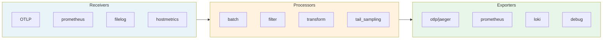
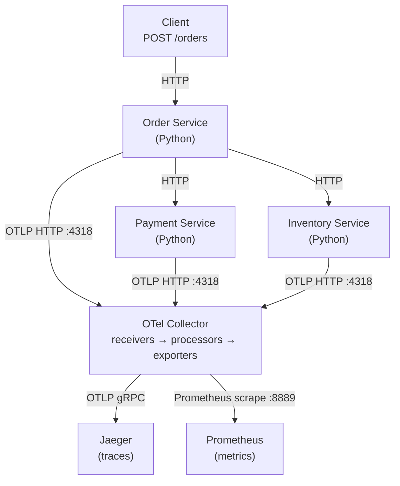
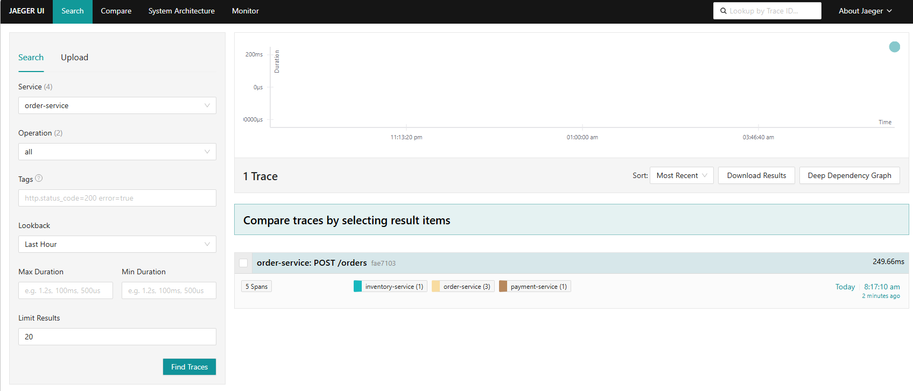
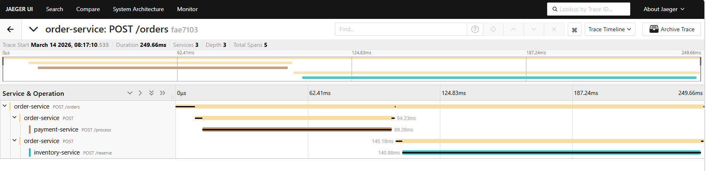
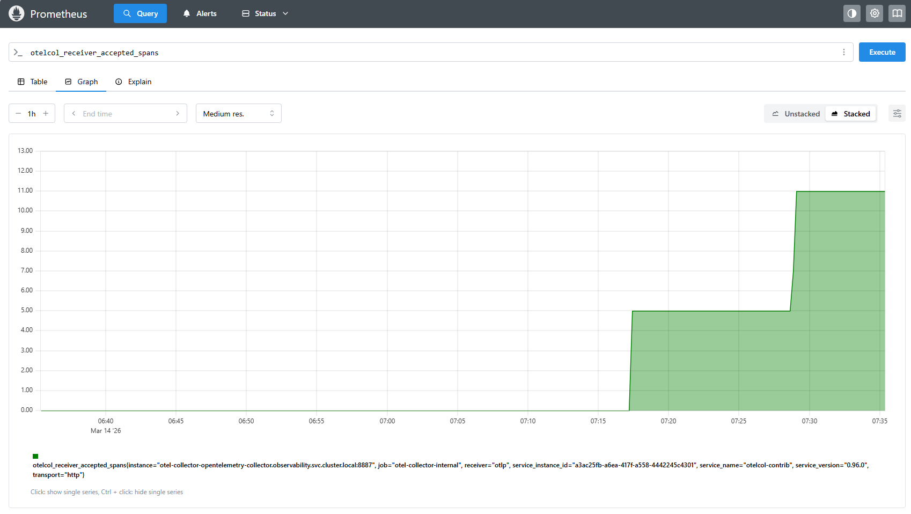
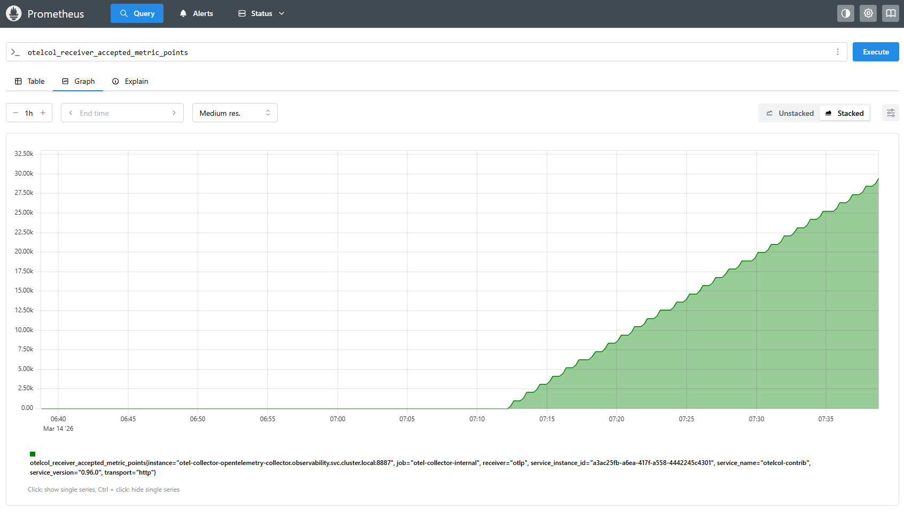
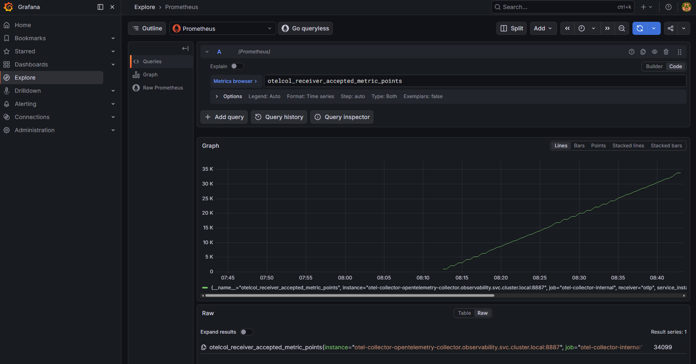
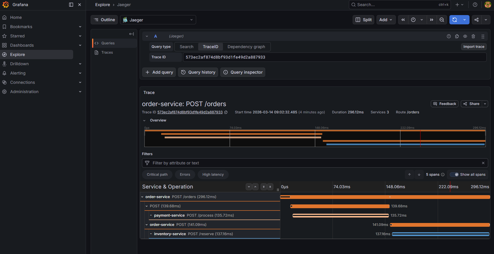

# 02 — Collector Pipeline: Receivers, Processors, Exporters

> Master the OTel Collector pipeline architecture — the core of any observability strategy.

## ⚠️ Prerequisites

Before exploring this module, make sure you have completed the installation steps from the [main README](../README.md).

---

## 🎯 Learning Objectives

- Understand the Collector's pipeline model (receivers → processors → exporters)
- Visualize traces flowing through the pipeline in Jaeger
- Query Collector metrics in Prometheus
- Inspect the live pipeline configuration

## 🧠 Key Concept: The Collector Pipeline



---

## 🏗️ Demo Architecture

The observability stack is built around a 3-service e-commerce application. All telemetry flows through the OTel Collector before reaching Jaeger and Prometheus.



---

## 🔭 Explore the Pipeline in Action

### Step 1: Open port-forwards

```bash
kubectl port-forward svc/jaeger-query -n observability 16686:16686 &
kubectl port-forward svc/kube-prometheus-stack-prometheus -n observability 9090:9090 &
kubectl port-forward svc/kube-prometheus-stack-grafana -n observability 3000:80 &
```

### Step 2: Jaeger — visualize distributed traces

Open [http://localhost:16686](http://localhost:16686)

- Select service `order-service` → **Find Traces**
- Click on a trace → see the full span waterfall across 3 services
- Click **System Architecture** → see the service dependency map





**What to look for:** each span represents one hop in the pipeline — App → Collector → Jaeger.

### Step 3: Prometheus — query Collector metrics

Open [http://localhost:9090](http://localhost:9090) and run these queries:

```promql
# Spans received by the Collector
otelcol_receiver_accepted_spans

# Spans refused by the Collector
otelcol_receiver_refused_spans

# Metric points received by the Collector
otelcol_receiver_accepted_metric_points

# Log records received by the Collector
otelcol_receiver_accepted_log_records

# Collector memory usage
otelcol_process_memory_rss{job="otel-collector-internal"}
```





### Step 4: Grafana — explore with dashboards

Open [http://localhost:3000](http://localhost:3000) (credentials: `admin` / `admin`)

- **Explore → Prometheus** → paste the PromQL queries above
- **Explore → Jaeger** → use **TraceID** mode: copy a trace ID from the Jaeger UI ([http://localhost:16686](http://localhost:16686)) and paste it here to correlate with metrics
  - In Jaeger UI: select `order-service` → Find Traces → click a trace → copy the ID from the URL, e.g. `http://localhost:16686/trace/573ec2af874d8bf93d1fe49d2a887933`

> **Note:** The Jaeger Search mode (by service name) is not available in Grafana 12 due to a known gzip compatibility issue with Jaeger 1.54. Use the Jaeger UI directly for trace search.





### Step 5: Inspect the live Collector config

```bash
kubectl get configmap -n observability \
  -l app.kubernetes.io/name=opentelemetry-collector \
  -o jsonpath='{.items[0].data.relay}' | less
```

Compare what you see with the values file: [`otel-collector-advanced-values.yaml`](otel-collector-advanced-values.yaml)

---

## 🔍 Understanding Processors

### Batch Processor (mandatory for production)
```yaml
processors:
  batch:
    timeout: 5s              # Flush every 5 seconds
    send_batch_size: 1024    # Or when batch reaches 1024 items
    send_batch_max_size: 2048 # Hard cap per batch
```

### Filter Processor (drop unwanted data)
```yaml
processors:
  filter/health:
    error_mode: ignore
    traces:
      span:
        - 'attributes["http.route"] == "/healthz"'
        - 'attributes["http.route"] == "/readyz"'
        - 'attributes["http.route"] == "/livez"'
```

### Attributes Processor (enrich data)
```yaml
processors:
  attributes/env:
    actions:
      - key: environment
        value: "learning-lab"
        action: upsert
      - key: cluster
        value: "otel-lab"
        action: upsert
```

---

## ✅ Success Criteria

- [ ] Traces visible in Jaeger with spans across 3 services
- [ ] PromQL queries return Collector metrics in Prometheus
- [ ] Grafana shows data from both Prometheus and Jaeger
- [ ] You can explain receivers → processors → exporters

## 📁 Files in this module

| File | Description |
|:-----|:------------|
| `otel-collector-advanced-values.yaml` | Multi-backend Collector pipeline config |
| `kube-prometheus-stack-values.yaml` | Prometheus + Grafana Helm values |

## ➡️ Next: [03 — Auto-Instrumentation](../03-auto-instrumentation/)
