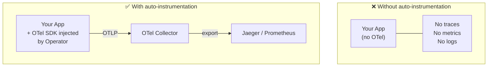

# 03 — Auto-Instrumentation: Zero-Code Observability

> Add traces, metrics, and logs to your apps without changing a single line of code.

## ⚠️ Prerequisites

Before exploring this module, make sure you have completed the installation steps from the [main README](../README.md).

---

## 🎯 Learning Objectives

- Understand how the OTel Operator injects the SDK automatically
- Inspect the init container injected into your pods
- See traces appear in Jaeger without any code changes
- Understand the difference between manual and auto instrumentation

## 🧠 Key Concept: Auto-Instrumentation

OpenTelemetry auto-instrumentation injects SDK agents into your pods at startup. The OTel Operator watches for pods annotated with `instrumentation.opentelemetry.io/inject-python: "true"` and injects an init container that sets up the SDK before your app starts.



**Zero code changes required!**

---

## 🔭 Explore Auto-Instrumentation in Action

### Step 1: Verify the init container was injected

```bash
kubectl describe pod -l app=order-service -n demo
```

Look for the `Init Containers` section:

```
Init Containers:
  opentelemetry-auto-instrumentation-python:
    Image: ghcr.io/open-telemetry/opentelemetry-operator/autoinstrumentation-python:0.50b0
```

This init container copies the Python OTel SDK into a shared volume before your app starts. The `PYTHONPATH` environment variable is then set automatically to load it via `sitecustomize.py`.

### Step 2: Inspect the injected environment variables

```bash
kubectl get pod -l app=order-service -n demo -o jsonpath='{.items[0].spec.containers[0].env}' | python3 -m json.tool
```

Key variables injected by the Operator:

| Variable | Value | Purpose |
|:---------|:------|:--------|
| `PYTHONPATH` | `/otel-auto-instrumentation-python/...` | Loads the SDK at startup via `sitecustomize.py` |
| `OTEL_SERVICE_NAME` | `order-service` | Service name in traces |
| `OTEL_EXPORTER_OTLP_ENDPOINT` | `http://otel-collector-...:4318` | Where to send telemetry (HTTP) |
| `OTEL_EXPORTER_OTLP_PROTOCOL` | `http/protobuf` | OTLP over HTTP |
| `OTEL_TRACES_EXPORTER` | `otlp` | Export traces via OTLP |
| `OTEL_METRICS_EXPORTER` | `otlp` | Export metrics via OTLP |
| `OTEL_LOGS_EXPORTER` | `otlp` | Export logs via OTLP |
| `OTEL_PROPAGATORS` | `tracecontext,baggage` | W3C trace context propagation |
| `OTEL_TRACES_SAMPLER` | `parentbased_traceidratio` | Sampling strategy |
| `OTEL_TRACES_SAMPLER_ARG` | `1.0` | 100% sampling rate |
| `OTEL_PYTHON_LOG_CORRELATION` | `true` | Correlates logs with trace IDs |
| `OTEL_PYTHON_LOGGING_AUTO_INSTRUMENTATION_ENABLED` | `true` | Auto-instruments Python logging |
| `OTEL_RESOURCE_ATTRIBUTES` | `k8s.pod.name`, `k8s.namespace.name`, ... | Kubernetes metadata enrichment |

### Step 3: Inspect the Instrumentation resource

```bash
kubectl get instrumentation -n demo
kubectl describe instrumentation -n demo
```

Compare with the config file: [`instrumentation.yaml`](instrumentation.yaml)

Key fields to understand:

```yaml
spec:
  exporter:
    endpoint: http://otel-collector-opentelemetry-collector.observability.svc.cluster.local:4318
  propagators:
    - tracecontext
    - baggage
  sampler:
    type: parentbased_traceidratio
    argument: "1.0"
  python:
    image: ghcr.io/open-telemetry/opentelemetry-operator/autoinstrumentation-python:0.50b0
```

> **Note:** Port `4318` is OTLP **HTTP**. Port `4317` is OTLP **gRPC**. The Python auto-instrumentation uses HTTP.

The `Instrumentation` CRD is **multi-language** — a single resource configures auto-instrumentation for all supported runtimes:

| Language | Image |
|:---------|:------|
| Python | `autoinstrumentation-python:0.50b0` |
| Java | `autoinstrumentation-java:2.1.0` |
| Node.js | `autoinstrumentation-nodejs:0.71.0` |
| .NET | `autoinstrumentation-dotnet:1.2.0` |
| Go | `autoinstrumentation-go:v0.23.0` |
| Apache HTTPD | `autoinstrumentation-apache-httpd:1.0.4` |
| Nginx | `autoinstrumentation-apache-httpd:1.0.4` |

Each language is activated by a different annotation on the pod, e.g.:
- Python: `instrumentation.opentelemetry.io/inject-python: "true"`
- Java: `instrumentation.opentelemetry.io/inject-java: "true"`
- Node.js: `instrumentation.opentelemetry.io/inject-nodejs: "true"`

### Step 4: Generate traffic and verify traces in Jaeger

```bash
./scripts/generate-traffic.sh
```

Open Jaeger UI at [http://localhost:16686](http://localhost:16686):

- Select `order-service` → **Find Traces**
- Click a trace → verify the waterfall shows spans from all 3 services:
  - `order-service` (root span)
  - `payment-service` (child span)
  - `inventory-service` (child span)

### Step 5: Check the annotation on the deployments

```bash
kubectl get deployment order-service -n demo -o jsonpath='{.spec.template.metadata.annotations}' | python3 -m json.tool
```

You should see:

```json
{
  "instrumentation.opentelemetry.io/inject-python": "true"
}
```

This single annotation is all that is needed to enable auto-instrumentation.

---

## 🔬 Manual vs. Auto Instrumentation

| Aspect | Auto-Instrumentation | Manual Instrumentation |
|:-------|:---------------------|:-----------------------|
| Code changes | None | Add SDK + instrument code |
| Setup effort | Add annotation | Import SDK, create spans |
| Granularity | Framework-level (HTTP, DB) | Custom spans anywhere |
| Custom attributes | Limited | Full control |
| Best for | Quick start, standard frameworks | Business-specific tracing |

**Recommendation:** Start with auto-instrumentation, then add manual spans for business-critical paths.

---

## ✅ Success Criteria

- [ ] Init container `opentelemetry-auto-instrumentation-python` visible in pod description
- [ ] `OTEL_SERVICE_NAME` and `OTEL_EXPORTER_OTLP_ENDPOINT` injected in pod env vars
- [ ] Traces appear in Jaeger with spans across all 3 services
- [ ] You can explain what the `Instrumentation` CRD does

## 📁 Files in this module

| File | Description |
|:-----|:------------|
| `instrumentation.yaml` | OTel Instrumentation CRD for Python |

## ➡️ Next: [04 — Distributed Tracing Demo](../04-distributed-tracing-demo/)
