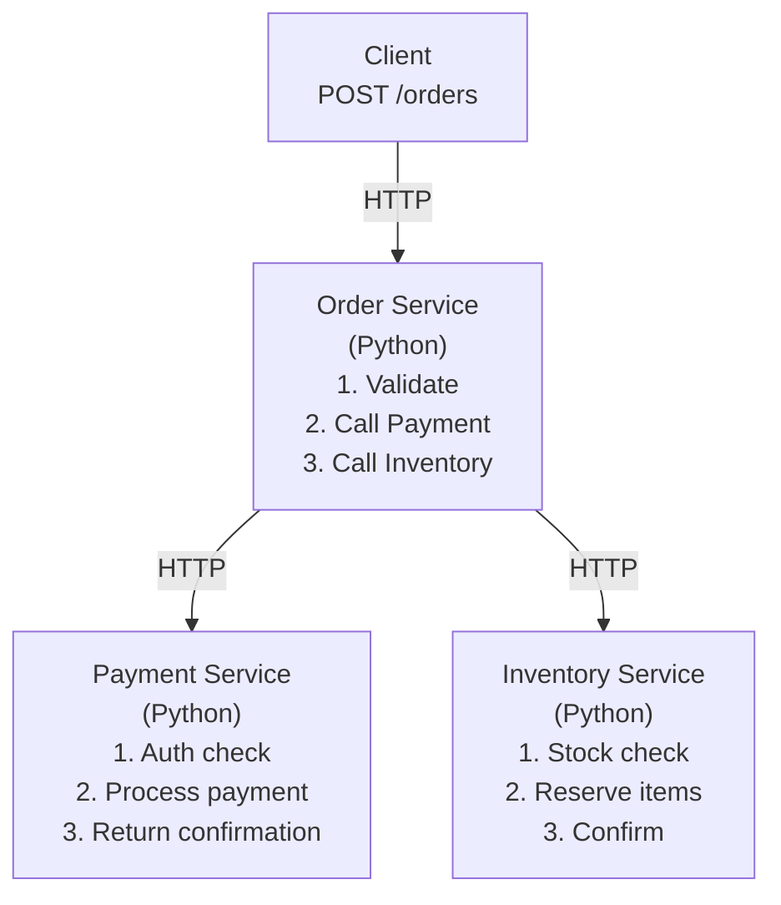
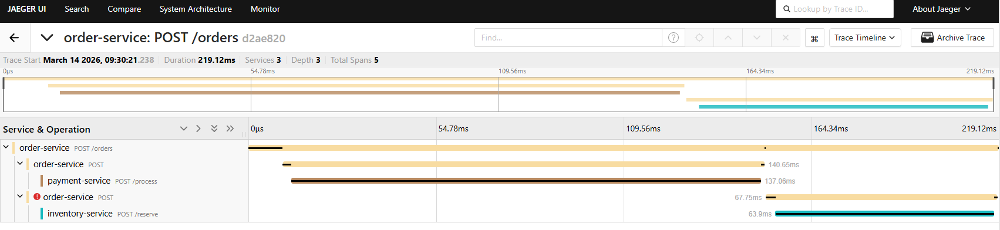

# 04 — Distributed Tracing Demo: E-Commerce Order Flow

> Trace a single request across 3 microservices — see exactly where time is spent.

## 🎯 Learning Objectives

- Deploy a 3-service e-commerce application (Order → Payment → Inventory)
- See end-to-end distributed traces in Jaeger
- Understand context propagation (W3C TraceContext)
- Identify performance bottlenecks across service boundaries
- Correlate traces with service dependency maps

## 🏗️ Demo Architecture



**Each service is auto-instrumented** — context propagation happens automatically via HTTP headers (traceparent).

## Step 1: Deploy the demo apps

```bash
# Deploy all 3 services
kubectl apply -f order-service.yaml
kubectl apply -f payment-service.yaml
kubectl apply -f inventory-service.yaml
```

## Step 2: Generate orders

```bash
# Port-forward the order service
kubectl port-forward svc/order-service -n demo 8080:8080

# Create an order (triggers the full chain)
curl -X POST http://localhost:8080/orders \
  -H "Content-Type: application/json" \
  -d '{"item": "laptop", "quantity": 1, "amount": 999.99}'

# Create multiple orders for interesting traces
for i in $(seq 1 10); do
  curl -s -X POST http://localhost:8080/orders \
    -H "Content-Type: application/json" \
    -d "{\"item\": \"item-$i\", \"quantity\": $((RANDOM % 5 + 1)), \"amount\": $((RANDOM % 1000))}" &
done
wait
echo "10 orders created!"
```

> **Note:** `item-1` to `item-10` are not in the inventory — these orders will return `insufficient_stock` errors, which is perfect for observing error traces in Jaeger. Use `laptop`, `phone`, `tablet`, `headphones`, or `keyboard` for successful orders.

## Step 3: Explore traces in Jaeger

```bash
kubectl port-forward svc/jaeger-query -n observability 16686:16686
# Open http://localhost:16686
```

**What to look for:**
1. **Service:** `order-service` → Find Traces
2. Click on a trace → see the full waterfall across 3 services
3. **Identify:** Which service takes the most time?
4. **Service Map:** Click "System Architecture" → see dependency graph

## Step 4: Introduce errors and observe

```bash
# This order will trigger an insufficient stock error in inventory-service
curl -X POST http://localhost:8080/orders \
  -H "Content-Type: application/json" \
  -d '{"item": "rare-item", "quantity": 9999, "amount": 50.00}'

# Check Jaeger — the trace will show:
# ✅ order-service span (started)
# ✅ payment-service span (success)
# ❌ inventory-service span (ERROR — insufficient stock)
# ❌ order-service span (failed — propagated error)
```

## 🔍 What You Should See in Jaeger

A single trace showing spans across all 3 services:



## ✅ Success Criteria

- [ ] All 3 services are running in the `demo` namespace
- [ ] Creating an order produces a distributed trace
- [ ] Trace spans all 3 services with correct parent-child relationships
- [ ] Error traces show the failing service clearly
- [ ] Service dependency map is visible in Jaeger

## 📁 Files in this module

| File | Description |
|:-----|:------------|
| `order-service.yaml` | Order Service deployment + ConfigMap |
| `payment-service.yaml` | Payment Service deployment + ConfigMap |
| `inventory-service.yaml` | Inventory Service deployment + ConfigMap |

## ➡️ Next: [05 — Sampling Strategies](../05-sampling-strategies/)
