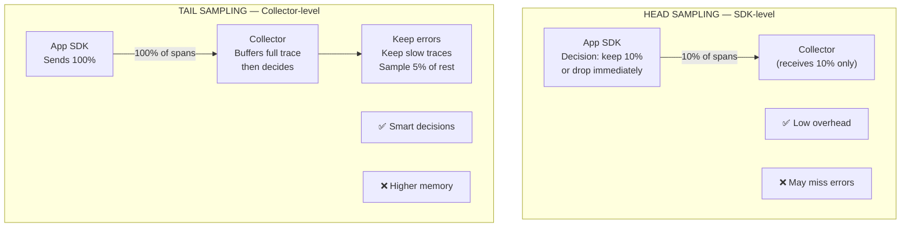
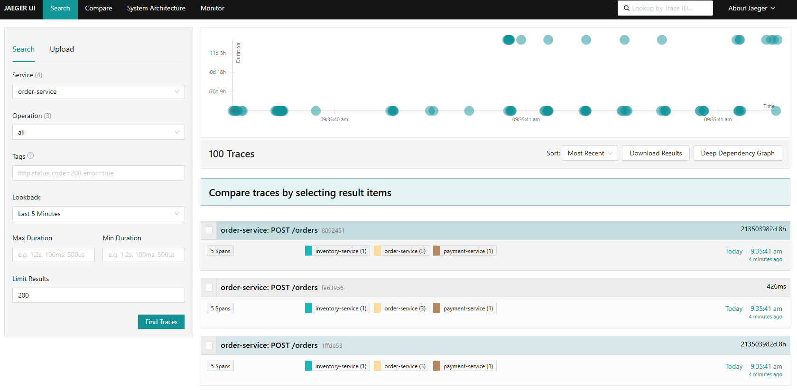
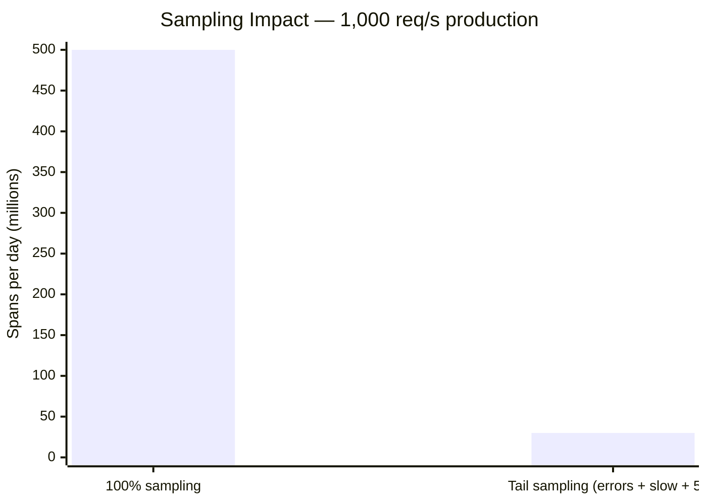

# 05 — Sampling Strategies: Head vs. Tail Sampling

> Reduce observability costs by 80%+ while keeping 100% of important traces.

## 🎯 Learning Objectives

- Understand why sampling is critical for production (cost + performance)
- Configure head sampling (SDK-level)
- Configure tail sampling (Collector-level)
- Choose the right strategy for your use case

## 🧠 Key Concept: Why Sample?

In production, 100% trace collection means:
- **Massive storage costs** (Jaeger/Datadog/Grafana Cloud charges per span)
- **Network overhead** (every request generates spans)
- **Collector CPU/memory** pressure

Most traces are normal, healthy requests. You only NEED traces for:
- ❌ Errors (HTTP 5xx, exceptions)
- 🐌 Slow requests (latency > threshold)
- 🆕 New deployments (canary traffic)

## Head Sampling vs. Tail Sampling



## Step 1: Head Sampling (via Instrumentation CRD)

```bash
kubectl apply -f head-sampling-instrumentation.yaml
```

## Step 2: Tail Sampling (via Collector config)

```bash
helm upgrade otel-collector open-telemetry/opentelemetry-collector \
  -n observability \
  -f tail-sampling-collector-values.yaml
```

## Step 3: Compare the results

Generate 100 requests:

```bash
for i in $(seq 1 100); do
  curl -s -X POST http://localhost:8080/orders \
    -H "Content-Type: application/json" \
    -d "{\"item\": \"laptop\", \"quantity\": 1, \"amount\": $((RANDOM % 1000))}" &
done
wait
```

Then open Jaeger at [http://localhost:16686](http://localhost:16686) and compare:

**Service:** `order-service` → **Lookback:** `Last 15 minutes` → **Limit:** `200` → **Find Traces**

| Sampling strategy | What you see in Jaeger |
|:------------------|:----------------------|
| 100% (default) | ~100 traces — every request visible |
| Head 10% | ~10 traces — random subset, errors may be missing |
| Tail sampling | All errors + slow requests + ~5 healthy traces |

**How to spot the difference:**

- **Trace count** — shown as `X Traces` at the top of the search results
- **Error traces** — shown with a red dot in the trace list; with tail sampling all errors are kept
- **Trace duration** — sort by `Longest First` to see if slow traces are preserved with tail sampling
- **Tags filter** — search `error=true` to count only error traces across strategies



## 💰 FinOps Impact Calculator



## ✅ Success Criteria

- [ ] Head sampling configured via Instrumentation CRD
- [ ] Tail sampling configured in Collector
- [ ] You can see the difference in trace count in Jaeger
- [ ] You can explain when to use head vs. tail sampling

## 📁 Files in this module

| File | Description |
|:-----|:------------|
| `head-sampling-instrumentation.yaml` | 10% head sampling via SDK |
| `tail-sampling-collector-values.yaml` | Smart tail sampling in Collector |

## ➡️ Next: [06 — Kyverno Governance](../06-kyverno-governance/)
