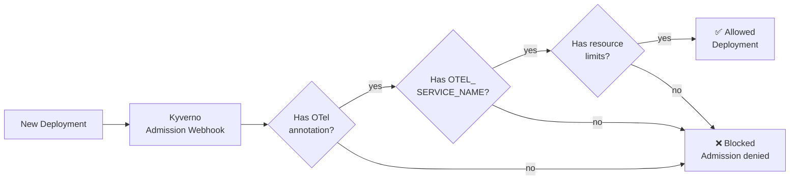

# 06 — Kyverno Governance: Enforce OTel Instrumentation

> Use policy-as-code to ensure every workload is observable. No blind spots.

## 🎯 Learning Objectives

- Enforce OTel auto-instrumentation annotations on all deployments
- Require `OTEL_SERVICE_NAME` environment variable
- Block deployments without resource limits (OTel SDK adds overhead)
- Audit observability compliance across namespaces

## 🧠 Key Concept: Governance for Observability

Auto-instrumentation only works if developers add the right annotations. Without governance, teams forget — and you get blind spots.

Kyverno policies ensure:



## Step 1: Install Kyverno

```bash
helm repo add kyverno https://kyverno.github.io/kyverno/
helm repo update
helm install kyverno kyverno/kyverno -n kyverno --create-namespace
```

## Step 2: Apply the OTel governance policies

```bash
# Enforce auto-instrumentation annotation
kubectl apply -f require-otel-instrumentation.yaml

# Require OTEL_SERVICE_NAME env var
kubectl apply -f require-otel-service-name.yaml

# Require resource limits (OTel overhead)
kubectl apply -f require-resource-limits.yaml
```

## Step 3: Test policy enforcement

```bash
# This deployment will be BLOCKED (no OTel annotation)
kubectl apply -f test-non-compliant.yaml
# Expected: admission webhook denied the request

# This deployment will be ALLOWED (fully compliant)
kubectl apply -f test-compliant.yaml
```

## Step 4: Check compliance reports

```bash
# View policy reports
kubectl get policyreport -A

# Detailed report
kubectl describe policyreport -n demo
```

## ✅ Success Criteria

- [ ] Kyverno is running
- [ ] Non-compliant deployments are blocked
- [ ] Compliant deployments are allowed
- [ ] Policy reports show compliance status

## 📁 Files in this module

| File | Description |
|:-----|:------------|
| `require-otel-instrumentation.yaml` | Enforce auto-instrumentation annotation |
| `require-otel-service-name.yaml` | Require OTEL_SERVICE_NAME env var |
| `require-resource-limits.yaml` | Require resource limits on all containers |
| `test-non-compliant.yaml` | Test deployment that should be blocked |
| `test-compliant.yaml` | Test deployment that should pass |

## 🔗 Series Complete!

You've completed the OpenTelemetry learning path:
1. ✅ Quick Start — Collector on K8s
2. ✅ Collector Pipeline — Receivers, Processors, Exporters
3. ✅ Auto-Instrumentation — Zero-code observability
4. ✅ Distributed Tracing — End-to-end request tracing
5. ✅ Sampling Strategies — Cost optimization
6. ✅ Kyverno Governance — Policy-as-code for observability
