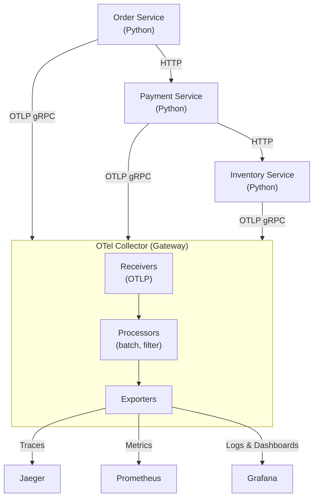
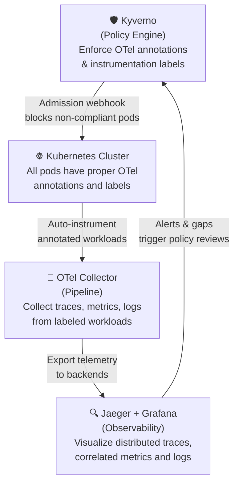

# OpenTelemetry Learning - First Sample

> "Learn OpenTelemetry with hands-on examples, auto-instrumentation, distributed tracing and observability governance for Kubernetes"

---

## Overview

This repository provides practical, hands-on training for OpenTelemetry, a CNCF-graduated observability framework. The focus goes beyond basic instrumentation, it demonstrates how to build a **unified observability pipeline** combining traces, metrics and logs, enforced by Kyverno policy-as-code.

---

## Key Learning Objectives

The materials cover:

- OTel Collector deployment on Kubernetes with the OpenTelemetry Helm chart
- Collector pipeline configuration: receivers, processors and exporters
- Zero-code auto-instrumentation for Python and Java applications
- Distributed tracing across a 3-service e-commerce demo (Order → Payment → Inventory)
- Head and tail sampling strategies for cost optimization
- Kyverno integration for observability governance and policy-as-code

---

## Repository Organization

```
opentelemetry-first-sample/
├── 01-quick-start/          # OTel Collector deployment with Helm
├── 02-collector-pipeline/   # Receivers, processors, and exporters configuration
├── 03-auto-instrumentation/ # Zero-code instrumentation for Python & Java
├── 04-distributed-tracing-demo/ # 3-service e-commerce tracing demo
├── 05-sampling-strategies/  # Head vs. tail sampling for cost optimization
├── 06-kyverno-governance/   # Enforce OTel instrumentation with policy-as-code
└── scripts/                 # Cluster setup, traffic generation, and cleanup
```

---

## Quick Start Steps

1. Clone the repository
2. Run `chmod u+x ./scripts/minikube-cluster.sh` and execute it to create the cluster:
   ```bash
   chmod u+x ./scripts/minikube-cluster.sh
   ./scripts/minikube-cluster.sh
   ```
3. Run `chmod u+x ./scripts/setup-all.sh` to make the script executable
4. Execute `./scripts/setup-all.sh` to deploy the full observability stack
5. Apply the e-commerce demo services:
   ```bash
   kubectl apply -f 04-distributed-tracing-demo/order-service.yaml
   kubectl apply -f 04-distributed-tracing-demo/payment-service.yaml
   kubectl apply -f 04-distributed-tracing-demo/inventory-service.yaml
   ```
6. Install Kyverno and apply observability governance policies:
   ```bash
   helm repo add kyverno https://kyverno.github.io/kyverno/
   helm install kyverno kyverno/kyverno -n kyverno --create-namespace
   kubectl apply -f 06-kyverno-governance/require-otel-annotations.yaml
   kubectl apply -f 06-kyverno-governance/require-tracing-labels.yaml
   kubectl apply -f 06-kyverno-governance/validate-instrumentation.yaml
   ```
7. Start port-forwards (run each in background):
   ```bash
   kubectl port-forward svc/jaeger-query 16686:16686 -n observability &
   kubectl port-forward svc/kube-prometheus-stack-prometheus 9090:9090 -n observability &
   kubectl port-forward svc/kube-prometheus-stack-grafana 3000:80 -n observability &
   # Grafana credentials: admin / admin
   ```
8. Generate traffic and observe telemetry:
   ```bash
   chmod u+x ./scripts/generate-traffic.sh
   ./scripts/generate-traffic.sh
   ```
   - Open Jaeger UI at [http://localhost:16686](http://localhost:16686) to explore distributed traces
   - Open Prometheus at [http://localhost:9090](http://localhost:9090) to query metrics
   - Open Grafana at [http://localhost:3000](http://localhost:3000) (credentials: `admin` / `admin`)

   **Go deeper — explore each module:**

   | Module | What to explore |
   |--------|----------------|
   | [02-collector-pipeline/](02-collector-pipeline/) | Review the Collector pipeline config: receivers, processors, exporters |
   | [03-auto-instrumentation/](03-auto-instrumentation/) | Inspect the `Instrumentation` resource and how Python apps get auto-instrumented |
   | [04-distributed-tracing-demo/](04-distributed-tracing-demo/) | Read the service code and trace the Order → Payment → Inventory flow in Jaeger |
   | [05-sampling-strategies/](05-sampling-strategies/) | Apply head and tail sampling configs to reduce trace volume |
   | [06-kyverno-governance/](06-kyverno-governance/) | Apply Kyverno policies to enforce OTel instrumentation on every deployment |

9. Clean up all resources when done:
   ```bash
   chmod u+x ./scripts/cleanup.sh
   ./scripts/cleanup.sh
   ```

---

## The Observability Pipeline



---

## The Governance Loop

What makes this sample unique is the combination of **observability with policy-as-code**:



**Without Kyverno:** Services are deployed without OTel annotations — no traces, incomplete metrics, invisible failures.

**With Kyverno:** Every pod has enforced instrumentation annotations → the OTel Collector auto-instruments workloads → full observability from day one.

---

## Observability Labels Convention

Consistent labeling is the foundation of correlated telemetry. This sample enforces:

| Label | Purpose | Example |
|-------|---------|---------|
| `app` | Service identification | `app: order-service` |
| `team` | Ownership | `team: platform` |
| `environment` | Env segmentation | `environment: production` |
| `instrumentation` | Auto-instrumentation trigger | `instrumentation: otel` |

---

## Prerequisites

- Minikube (local Kubernetes cluster)
- kubectl 1.28+
- Helm v3
- 4 CPU cores and 8GB RAM minimum

---

## Cleanup

To remove all deployed resources:

```bash
chmod u+x ./scripts/cleanup.sh
./scripts/cleanup.sh
```

The script removes demo services, Kyverno, the OTel Collector, Jaeger, Prometheus, Grafana, and optionally deletes the cluster.

---

## Troubleshooting

If you encounter issues (missing traces, empty dashboards, collector not starting, etc.), refer to the [TROUBLESHOOTING.md](./TROUBLESHOOTING.md) guide.

---

## Related Resources

- Official OpenTelemetry documentation at opentelemetry.io/docs
- OTel Collector configuration reference
- OpenTelemetry Helm chart
- Jaeger distributed tracing documentation
- Kyverno policy library and documentation
- Community: CNCF Slack #opentelemetry

---

## License

This repository is licensed under Creative Commons Attribution-ShareAlike 4.0 International License.

[](https://creativecommons.org/licenses/by-sa/4.0/)
